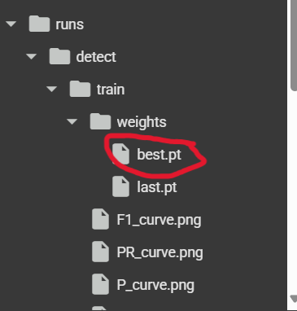

# YOLO Object Detection Project

## **Project Overview**
This project demonstrates how to train and use a YOLO (You Only Look Once) model for object detection. The workflow includes converting a video into frames, labeling the frames, training the YOLO model, and using the trained model for object detection on videos or images.

<div align="center">
   <video controls>
       <source src="data/Output_video.mp4" type="video/mp4">
       Your browser does not support the video tag.
   </video>
</div>


---

## **How It Works**
1. **Convert Video to Frames**:
   - A video is split into individual frames using the `ImageToFrames.py` script.
   - The frames are stored in the `data/frames` folder.

2. **Label the Frames**:
   - Each frame is labeled using the `LabelImg` tool in Python.
   - The labeled data is saved in `.xml` format in the `data/labels` folder.

   <div align="center">
   <video controls>
       <source src="data/Lable_video.mp4" type="video/mp4">
       Your browser does not support the video tag.
   </video>
</div>

3. **Convert Labels to YOLO Format**:
   - The `.xml` labels are converted to YOLO-compatible `.txt` format using the `xmlConverter.py` script.

4. **Organize Data**:
   - The labeled data is organized into the following structure:
     ```
     rawData/
         images/
             training/
             validation/
         labels/
             training/
             validation/
     ```

5. **Prepare Data for Training**:
   - The organized data is compressed into a `.zip` file and uploaded to Google Drive.

6. **Train the YOLO Model**:
   - The `Train_YOLO_Model.ipynb` notebook is used in Google Colab to train the YOLO model.
   - The trained model is saved as `weights/best.pt`.

7. **Use the Trained Model**:
   - The trained model is used for object detection on videos or images using scripts like `TestOnImage.py` and `TestOnVideo.py`.

---

## **Steps to Train the YOLO Model**

### 1. **Convert Video to Frames**
- Run the `ImageToFrames.py` script to extract frames from a video.
- The frames will be saved in the `data/frames` folder.

### 2. **Label the Frames**
- Use the `LabelImg` tool to label the frames.
- Save the labels in `.xml` format in the `data/labels` folder.

### 3. **Convert Labels to YOLO Format**
- Run the `xmlConverter.py` script to convert `.xml` labels to `.txt` format.

### 4. **Organize Data**
- Arrange the data in the following structure:

    ```bash
    rawData/
        images/
            training/
            validation/
        labels/
            training/
            validation/
    ```

### 5. **Upload Data to Google Drive**
- Compress the `rawData` folder into a `.zip` file and upload it to Google Drive.

### 6. **Train the Model**
- Open the `Train_YOLO_Model.ipynb` notebook in Google Colab.
- Mount Google Drive and unzip the data.
- Train the YOLO model using the notebook.
- Download the trained model (`weights/best.pt`) after training.



---

## **How to Use the Repository**

### 1. **Clone the Repository**
```bash
git clone <repository_url>
cd Train YOLO Model
```
### 2. **Install Depedencies**
- Install the required Python packages:
```bash
pip install -r requirements.txt
```
### 3. **Run Object Detection on Image**
- Use the `TestOnImage.py` script to perform object detection on an image:
```bash
python utils/TestOnImage.py
```
### 4. **Run Object Detection on Video**
- Use the `TestOnVideo.py` script to perform object detection on an video:
```bash
python utils/TestOnVideo.py
```

---

## Folder Structure
```bash
Train YOLO Model/
├── main.py                # Main script for video processing
├── [Readme.md](http://_vscodecontentref_/1)              # Project documentation
├── requirements.txt       # Python dependencies
├── data/                  # Data folder
│   ├── video1.mp4         # Sample video
│   ├── frames/            # Extracted frames
│   ├── labels/            # Labeled data
├── utils/                 # Utility scripts
│   ├── ImageToFrames.py   # Script to convert video to frames
│   ├── TestOnImage.py     # Script to test YOLO on images
│   ├── TestOnVideo.py     # Script to test YOLO on videos
│   ├── Train_YOLO_Model.ipynb  # Colab notebook for training
│   ├── xmlConverter.py    # Script to convert XML labels to YOLO format
├── weights/               # Folder for YOLO weights
│   ├── best.pt            # Trained YOLO model
│   ├── coco1.txt          # Class list
```

--- 

## Example Workflow
### Video to Frames
- Input: `data/video1.mp4`
- Output: Frames in `data/frames/`
### Labeling
- Input: Frames in `data/frames/`
- Output: `.xml` labels in `data/labels/`
### Training
- Input: Organized data in `rawData/`
- Output: Trained model `weights/best.pt`
### Testing
- Input: Trained model and test `video/image`
- Output: Detected objects with bounding boxes and labels.

---

### Notes
- Ensure the `weights/best.pt` file is present in the `weights/` folder before running detection scripts.
- Modify paths in the scripts as needed to match your directory structure.